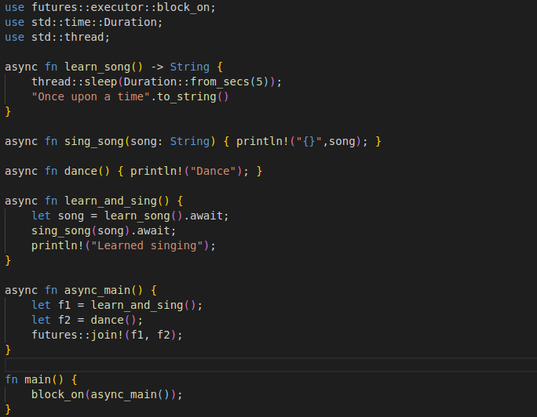

# Hands-on approach to Async-Rust

## Getting started
Most of the populor languages offers asynchronous feature that allow us to run multiple operations on a single thread without wasting other threads.

Rust impacts every aspect of field inclusively advanced OS, bare-metals, embedded devices, web backends and more. As far as concern of async Rust not a single diluted diversity to perform ```async/await.``` 

## Orientation to Async-Rust
The word async is comprised from asynchronous which is not new in programming world. Simply say, the idea is performing multiple tasks simultaneously obvoius that is not actually happen parallerly as it can not be achieved on single microprocessor. Here comes a technique called asynchronuous, lets say perform task one after interval of time it halts then swithces to perform task two and traverse back to task one again and so forth utill both tasks tends to completed.

But this phenomenon is also can be achieved from synchronous stretegy. To clear in both technical terms we compare it to crystalize the idea and which is suitable for your project?

|    Asynchronous    |    Syncronous    |
| ----------------- | :---------------: |
|  Single thread.   |  Multiple threads.  |
| Multiple tasks on single thread. | One task on one thread. 
| Asynchronous code can be write in synchronous by using executors. | Synchronous code can be write in Asynchronous code. |   
| Best for low end machines | Best for high end Machines |

> Note: High OR low end machine may decide upon your application that is your machine is enough able to run your application perfectly. 


## Configurations Before Starting 
We need to configure atleast two crates for later use.

In ```cargo.toml``` file we pull two creates

#### 1. Pulling Dependencies


1. ```Future``` resides in official ```rust-lang``` repo version ```0.3.5```.
2. ```async-std``` version ```1.6.0```.


In ```main.rs``` file:

#### 2. Calling libraries 


1. ```future::executor::block_on``` runs async functions firstly then allow other code to run in ```fn main()```.
2. ```std::time::Duration``` to use time in program for specific duration. 
3. ```std::thread``` threading for synchronous.

#### 3. Async Functions
```learn_song()``` function took 5 seconds to learn song.


> Thread to use sleeping for 5 seconds 

Two more functinos wrote:
```sing_song(song: String)```-> Write song. 
```dance()```-> Write dance


One more function added:
```learn_and_sing()``` -> Sing song after learinig song.


We have 2 type of executors:
1. ```await```: makes asynchronuous function behave like synchronuous.
2. ```join```: allow us to exec. more than 2 asynchronous functions at same time.
     
Wait until the song has been learned before singing it. We use `.await` here rather than `block_on` to prevent blocking the
thread, which makes it possible to `dance` at the same time.


`join!` is like `.await` but can wait for multiple futures concurrently. If we're temporarily blocked in the `learn_and_sing()` future, the `dance()`
future will take over the current thread. If `dance()` has blocked, `learn_and_sing()` can take back over. If both futures are blocked, then
`async_main()` is blocked and will yield to the executor.


`block_on()` run asynchronous function as synchronously. This won't allow other code to run before execution of function calling `async_main()` inside `block_on()`

Now whole code look like this.



First learn song, after learning song then dance.


